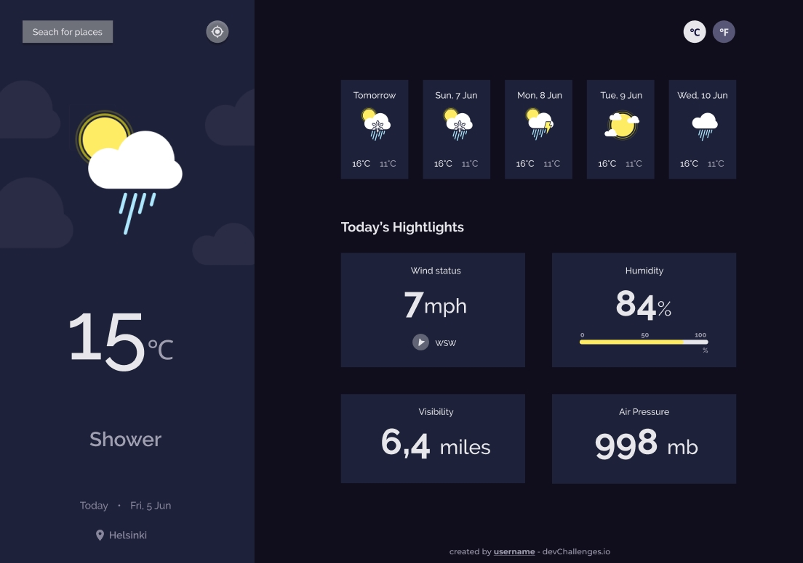

#  Weather app

<!--  -->

## Welcome! 👋

**WORK IN PROGRESS!!!**

This is a solution to the [Weather app](https://devchallenges.io/challenges/mM1UIenRhK808W8qmLWv) challenge on [devchallenges.io](https://devchallenges.io).

## 🔗 Live Link / Demo Link:

- https://alapina.github.io/Weather-app-Challenge/

## 🛠 Technologies Used:

- 💅 [Styled components](https://styled-components.com/)
-  [React hooks](https://reactjs.org/docs/hooks-intro.html) (useState , useEffect)
- Api requests with [axios](https://github.com/axios/axios)
- [GitHub action](https://github.com/JamesIves/github-pages-deploy-action) for automatically deploying the project to GitHub pages.
- Testing with [Jest](https://jestjs.io/) and [Cypress](https://www.cypress.io/)

## Additional

- **Styled components**

  - css color variables (themes) https://styled-components.com/docs/advanced#theming
  - global styles https://scalablecss.com/styled-components-global-styles/
  - styled-normalize https://github.com/sergeysova/styled-normalize

- **react-icons**

  - library with icons https://react-icons.github.io/react-icons
  - npm https://www.npmjs.com/package/react-icons

- [toLocaleString()](https://developer.mozilla.org/en-US/docs/Web/JavaScript/Reference/Global_Objects/Date/toLocaleString) to define current date

- **Dealing with long word in text box:**

  - https://justmarkup.com/articles/2015-07-31-dealing-with-long-words-in-css/
  - Location text can be long, so I added width in % to textbox and overflow-wrap: break-word;

- **User Location**

  - We can find user location by Geolocation API and IP address.
  - On Weather Info we find location by IP address, but on find current location button we will use Geo API
  - https://blog.logrocket.com/detect-location-and-local-timezone-of-users-in-javascript-3d9523c011b9/
  - https://developer.mozilla.org/en-US/docs/Web/API/Geolocation_API

- **Weather API**
  - https://openweathermap.org/
  - https://openweathermap.org/api/one-call-api
  - icons https://openweathermap.org/weather-conditions#How-to-get-icon-URL
- **How to save API key secretly**
  - https://www.twilio.com/blog/2017/08/working-with-environment-variables-in-node-js.html
  - https://www.npmjs.com/package/dotenv
  - But with create react app it's easy https://create-react-app.dev/docs/adding-custom-environment-variables/
  - https://create-react-app.dev/docs/adding-custom-environment-variables/#adding-development-environment-variables-in-env
